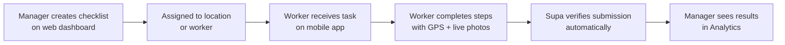

Supa links your management team to your frontline workers through a closed-loop verification system. This page explains the two interfaces, the workflow that connects them, and the mechanisms Supa uses to ensure that what gets reported actually happened.

## Two interfaces, one platform

Supa runs on two surfaces that work together in real time.

<Tabs>
  <Tab title="Web dashboard">
    The web dashboard is where managers and administrators run operations. You use it to:

    - Create and publish checklists, audits, and tasks
    - Assign work to locations, departments, or individual workers
    - Monitor real-time completion status across all your sites
    - Review submitted evidence — GPS coordinates, live photos, and timestamps
    - Generate compliance reports and track trends in Analytics
    - Manage your team, roles, and organization settings

    The dashboard is accessible from any browser. No installation required.
  </Tab>
  <Tab title="Mobile app">
    The Supa mobile app is the tool your frontline workers use every day. Available for iOS and Android, it gives workers:

    - A daily view of all assigned checklists and tasks
    - Step-by-step checklist completion with in-app photo capture
    - GPS-stamped submissions that prove on-site presence
    - Heads Up announcements with read confirmation
    - Team Chat for coordination with colleagues and managers
    - Access to training lessons linked to their role and location

    Workers only need the app — they do not need access to the web dashboard.
  </Tab>
</Tabs>

## The verification workflow

Every operation in Supa follows the same five-stage loop.

```text
Create → Assign → Execute → Verify → Report
```

**Create:** A manager builds a checklist, task, or training module on the web dashboard. They set the requirements — which items need photos, what scores pass or fail, and how frequently it runs.

**Assign:** The manager assigns the work to a location, department, or specific worker. Workers receive a push notification on their mobile app.

**Execute:** The worker opens Supa on their phone and completes the checklist or task. For each step, they follow the instructions and capture any required evidence directly in the app.

**Verify:** Supa validates the submission automatically. GPS confirms the worker was on site. Live photo detection rejects any image pulled from the camera roll — only photos taken in the moment are accepted. Timestamps record exactly when each item was completed.

**Report:** The completed submission appears in the web dashboard instantly. Managers see the evidence without chasing anyone. Analytics aggregates submissions across all locations for trend reporting.

## Verification mechanisms

<CardGroup cols={2}>
  <Card title="GPS location verification" icon="map-pin">
    Every checklist submission is tagged with the worker's GPS coordinates. Managers can confirm the worker was physically present at the correct site when they completed the work.
  </Card>

  <Card title="Live photo upload" icon="camera">
    Steps that require visual proof use the phone camera directly. Supa automatically rejects photos uploaded from the camera roll — evidence must be captured in the moment.
  </Card>

  <Card title="Timestamp tracking" icon="clock">
    Each item in a checklist or task is recorded with the exact time it was completed. This creates a reliable, tamper-resistant activity log for audits and investigations.
  </Card>

  <Card title="Read receipts" icon="check-check">
    Heads Up announcements track who has read each message. Managers can see exactly which team members have acknowledged a broadcast and follow up with those who haven't.
  </Card>
</CardGroup>

<Warning>
  Supa's live photo detection is enforced at the system level. Workers cannot substitute a pre-taken photo for a live capture. If your compliance process requires visual evidence, this ensures that evidence is authentic.
</Warning>

## The AI layer

Supa includes AI capabilities that reduce the manual work of building and managing operations content.

**Content creation:** Describe a process in plain language and Supa generates a complete checklist or training module. You can also upload an existing SOP document and Supa extracts the items automatically.

**Document Q&A:** Workers and managers can ask plain-language questions about uploaded documents and receive instant answers — without searching through pages of text.

**15-language translation:** Supa translates checklists, training content, and announcements into 15 languages automatically, so your multilingual workforce always receives instructions in their preferred language.

<Info>
  AI-generated content is always editable. Review and adjust anything before publishing it to your team.
</Info>

## Data flow summary

Here is how information moves through Supa from creation to reporting:



Every step in this flow is automatic. No manual data entry, no chasing follow-ups, no emailed spreadsheets.

## Next steps

<CardGroup cols={2}>
  <Card title="Run your first checklist" icon="rocket" href="/quickstart">
    Follow the quickstart guide to set up your account and complete a GPS-verified checklist in under 10 minutes.
  </Card>

  <Card title="Explore Checklists & Audits" icon="clipboard-check" href="/features/checklists-audits">
    Learn how to build audit templates, configure scoring, and schedule recurring checks.
  </Card>
</CardGroup>